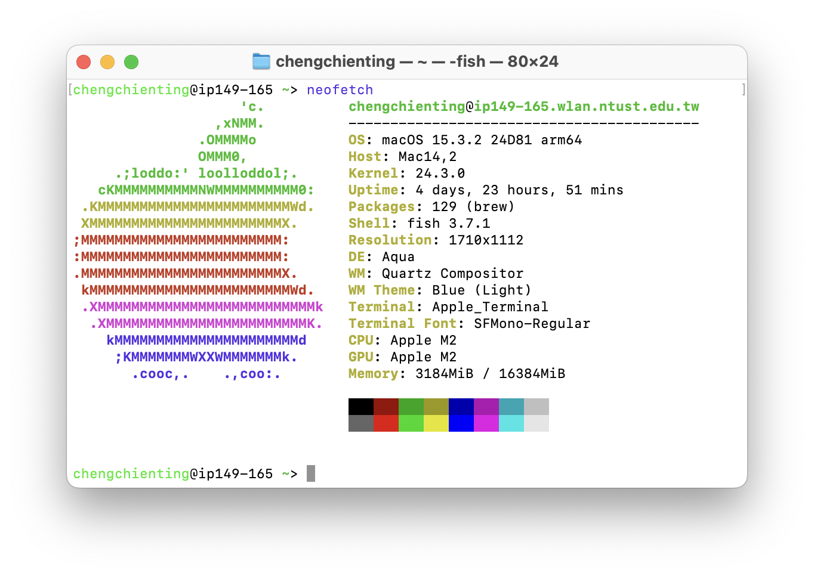
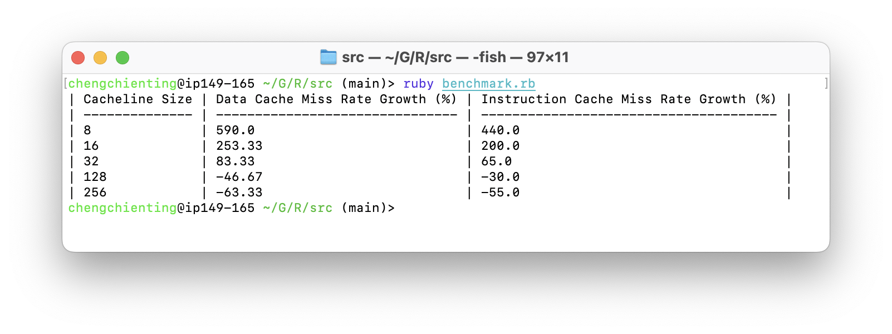

# CS2006301-Simulator with L1 Cache

四資工二乙 鄭健廷 B11130225

## 測試環境

### macOS



### gem5

```
gem5 Simulator System. https://www.gem5.org
gem5 is copyrighted software; use the --copyright option for details.
gem5 version 23.1.0.0
gem5 compiled May 8 2024 10:43:00
gem5 started May 19 2024 22:14:45
gem5 executing on HaydensPromini.lan, pid 30640
command line: ./gem5.opt
```

### RISC-V Toolchain

```
riscv64-unknown-elf-gcc (gc891d8dc2) 13.2.0
Copyright (C) 2023 Free Software Foundation, Inc.
This is free software; see the source for copying conditions. There is NO
warranty; not even for MERCHANTABILITY or FITNESS FOR A PARTICULAR PURPOSE.
```

### Ruby

```
ruby 2.6.10p210 (2022-04-12 revision 67958) [universal.arm64e-darwin23]
```

## 測試樣本

### C Source Code

```c
#include <stdio.h>
#include <stdlib.h>
#include <time.h>

#define ARRAY_SIZE 100000

int main()
{
    int arr[ARRAY_SIZE] = {0};
    srand(time(NULL));

    // Random access pattern
    for (int i = 0; i < ARRAY_SIZE; ++i)
    {
        int index = rand() % ARRAY_SIZE;
        arr[index]++;
    }

    // Sequential access pattern
    for (int i = 0; i < ARRAY_SIZE; ++i)
    {
        arr[i]++;
    }

    return 0;
}
```

### Benchmark ruby script

```ruby
require 'fileutils'

def run_simulation(l1i_size, l1i_assoc, l1d_size, l1d_assoc, cacheline_size, output_dir)
  FileUtils.mkdir_p(output_dir)
  system("../build/RISCV/gem5.opt ../configs/deprecated/example/se.py " \
         "--caches --l1i_size=#{l1i_size} --l1i_assoc=#{l1i_assoc} " \
         "--l1d_size=#{l1d_size} --l1d_assoc=#{l1d_assoc} " \
         "--cacheline_size=#{cacheline_size} " \
         "-c ./main " \
         "> #{output_dir}/gem5.log 2>&1")
  FileUtils.cp('m5out/stats.txt', "#{output_dir}/stats.txt")
  FileUtils.cp('m5out/config.ini', "#{output_dir}/config.ini")
end

def extract_miss_rate(stats_file)
  dcache_misses = `grep "system.cpu.dcache.overallMisses::total" #{stats_file}`.split[1]
  icache_misses = `grep "system.cpu.icache.overallMisses::total" #{stats_file}`.split[1]
  dcache_accesses = `grep "system.cpu.dcache.overallAccesses::total" #{stats_file}`.split[1]
  icache_accesses = `grep "system.cpu.icache.overallAccesses::total" #{stats_file}`.split[1]

  if [dcache_misses, icache_misses, dcache_accesses, icache_accesses].any?(&:nil?)
    raise "Error: Failed to extract miss or access rates from #{stats_file}."
  end

  dcache_miss_rate = dcache_misses.to_f / dcache_accesses.to_f
  icache_miss_rate = icache_misses.to_f / icache_accesses.to_f

  [dcache_miss_rate, icache_miss_rate]
end

# 基準配置
run_simulation("8kB", 2, "8kB", 2, 64, "m5out/base")

# 修改 cacheline_size 配置 (8~256)
cacheline_sizes = [8, 16, 32, 128, 256]
cacheline_sizes.each do |cacheline_size|
  run_simulation("8kB", 2, "8kB", 2, cacheline_size, "m5out/cacheline_size=#{cacheline_size}")
end

# 基準配置的未命中率
base_rates = extract_miss_rate("m5out/base/stats.txt")
base_dcache_miss_rate = base_rates[0]
base_icache_miss_rate = base_rates[1]

# 打印表格標題
puts "| Cacheline Size | Data Cache Miss Rate Growth (%) | Instruction Cache Miss Rate Growth (%) |"
puts "| -------------- | ------------------------------- | -------------------------------------- |"

# 比較不同配置的未命中率
cacheline_sizes.each do |cacheline_size|
  rates = extract_miss_rate("m5out/cacheline_size=#{cacheline_size}/stats.txt")
  dcache_miss_rate = rates[0]
  icache_miss_rate = rates[1]
  dcache_miss_growth = ((dcache_miss_rate - base_dcache_miss_rate) / base_dcache_miss_rate * 100).round(2)
  icache_miss_growth = ((icache_miss_rate - base_icache_miss_rate) / base_icache_miss_rate * 100).round(2)

  # 格式化輸出以對齊隔線
  puts "| #{cacheline_size.to_s.ljust(14)} | #{dcache_miss_growth.to_s.ljust(31)} | #{icache_miss_growth.to_s.ljust(38)} |"
end
```

## 結果分析



| Cacheline Size | Data Cache Miss Rate Growth (%) | Instruction Cache Miss Rate Growth (%) |
| -------------- | ------------------------------- | -------------------------------------- |
| 8              | 590.0                           | 440.0                                  |
| 16             | 253.33                          | 200.0                                  |
| 32             | 83.33                           | 65.0                                   |
| 128            | -46.67                          | -30.0                                  |
| 256            | -63.33                          | -55.0                                  |

## 結論

### 主要發現

1. **⼩快取的影響**：

   當快取⼤⼩為8KB和16KB時，數據快取和指令快取的未命中率顯著增加。8KB快取的數據快取未命中率增長了590.0%，指令快取未命中率增長了440.0%；⽽16KB快取的數據快取未命中率增長了253.33%，指令快取未命中率增長了200.0%。由此可知，較⼩的快取線⼤⼩可能導致頻繁的快取未命中，降低整體性能。

2. **中等快取的影響**：
3. 快取⼤⼩為32KB時，未命中率雖然較基準配置有所降低，但仍⾼於較⼤的快取。數據快取和指令快取未命中率分別增加了83.33%和65.0%，這說明適度增加快取⼤⼩可以部分緩解未命中問題，但效果有限。

3. **⼤快取的影響**：
4. 當快取⼤⼩達到128KB和256KB時，未命中率顯著下降。128KB快取的數據快取未命中率減少了46.67%，指令快取未命中率減少了30.0%；⽽256KB快取的數據快取未命中率減少了63.33%，指令快取未命中率減少了55.0%，這表明較⼤的快取線可以顯著減少快取未命中率，提⾼整體性能。

### 總結

從測試結果可以看出，快取⼤⼩對L1快取的性能有顯著影響。較⼤的快取（如128KB和256KB）能顯著降低數據和指令快取的未命中率，從⽽提⾼系統性能。相比之下，較⼩的快取則會顯著增加未命中率，對性能產⽣負⾯影響。

因此，在設計快取架構時，選擇適當的快取⼤⼩是關鍵，應根據具體應⽤需求權衡快取命中率和存儲開銷。
